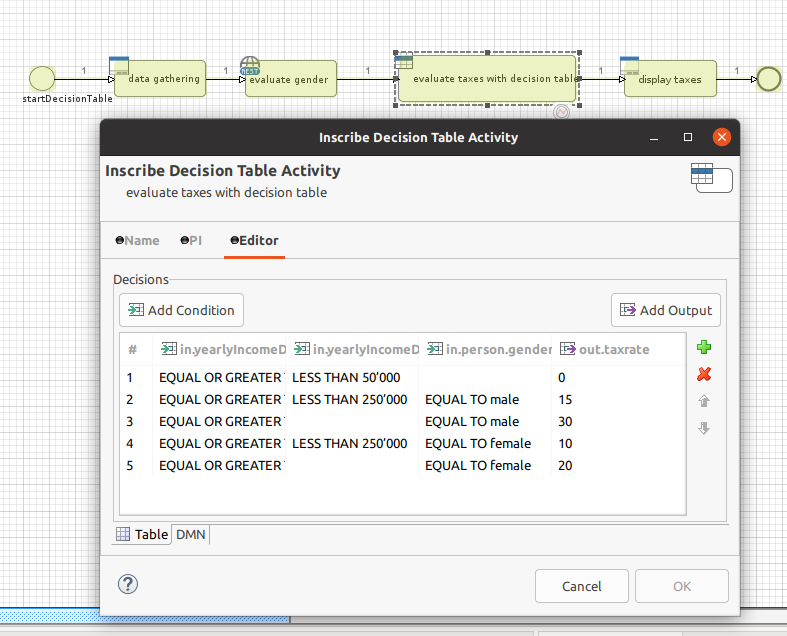

# Decision Table

A DMN (Decision Model and Notation) decision table is a tabular representation used to model business rules and decisions. It defines conditions and corresponding actions or outcomes, enabling automated decision-making based on inputs. With this utility you can integrate DMN tables into your Axon Ivy processes.

This utility:

- links process data to a decision table
- enables convenient condition editing with zero scripting
- supports DMN conformance level 3
- enables standardized XML-export

# Decision Table Activity
Simple and expressive decision table element. 

### DMN
Exposes the decision in standard [DMN](http://www.omg.org/spec/DMN/) format so that it can be run and edited in any DMN engine.

### Edit
Convenient condition editing with zero scripting

## Demo

After doing the setup you can download and import the demo project.

There is a demo process which gathers data and evaluates the tax
rate based on the yearly income and the gender of the person.

## Setup

If you need this extensions on an Axon Ivy Engine. Proceed as follows:

1. Download the `dmn-decision-table-*.jar`
2. Copy the file into the `dropins` directory of your Axon Ivy Engine
3. Start or restart Axon Ivy Engine
4. Deploy projects that involve DMN Decision Tables.
